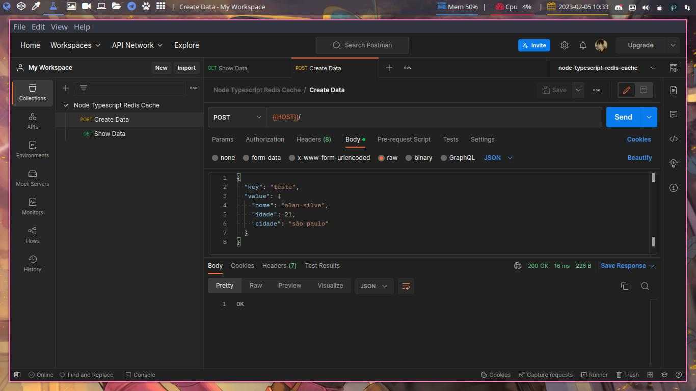
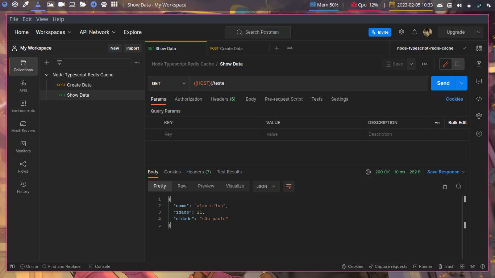

# node-typescript-redis-cache

desenvolvendo uma api node com typescript e express. objetivo é criar um sistema de cache com redis para acelerar a consulta aos dados.

## Exemplo de como funciona

